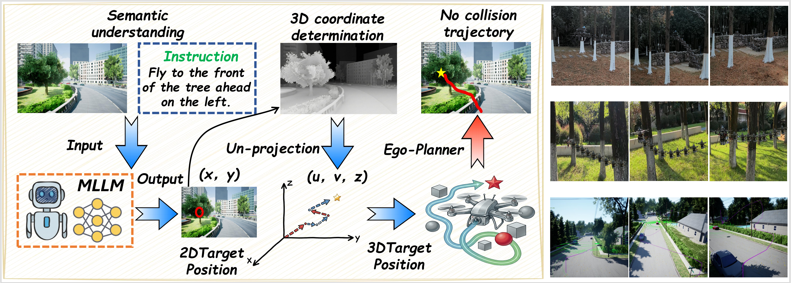

# Fly0: Decoupling Semantic Grounding from Geometric Planning for Zero-Shot Aerial Navigation

We introduce Fly0, a modular framework designed to decouple high-level semantic reasoning from low-level geometric planning for aerial navigation. Instead of forcing Multimodal Large Language Models (MLLMs) to directly output control signals—a paradigm prone to inefficiency and instability—Fly0 employs the MLLM as a dedicated semantic observer. Its role is to identify 2D target coordinates from visual-language inputs, which are then accurately projected into 3D space using depth-informed back-projection. Following this, a specialized gradient-based planner takes over to generate smooth, dynamically sound, and collision-free trajectories. This explicit separation of perception and action enables more robust, efficient, and scalable autonomous flight.

## System Overview



## Configuration

### Configuration File Structure

The system uses a JSON configuration file (`config.json`) to manage all settings. Here's a comprehensive example:

```json
{
    "API_TYPE": "openai",
    "OPENAI_API_KEY": "your-api-key-here",
    "OPENAI_BASE_URL": "https://api.openai.com/v1",
    "OPENAI_MODEL": "gpt-4-vision-preview",
    "OLLAMA_MODEL": "llama3.2-vision",
    "VLLM_BASE_URL": "http://localhost:8000/v1",
    "VLLM_MODEL": "your-vlm-model",
    "vision": {
        "enabled": true,
        "api_key": "your-vision-api-key",
        "base_url": "https://api.openai.com/v1",
        "model": "gpt-4-vision-preview"
    },
    "planner": {
        "lidar_sensors": ["LidarSensor1"]
    }
}
```

### Configuration Options

#### VLM Provider Settings

**API_TYPE**: Choose from `"ollama"`, `"openai"`, or `"vllm"`

**OpenAI Configuration:**

- `OPENAI_API_KEY`: Your OpenAI API key
- `OPENAI_BASE_URL`: API endpoint (default: https://api.openai.com/v1)
- `OPENAI_MODEL`: Model name (e.g., gpt-4-vision-preview, qwen2.5-vl-72b-instruct)

**Ollama Configuration:**

- `OLLAMA_MODEL`: Model name (e.g., llama3.2-vision, qwen2.5vl:3b-fp16)
- Default URL: http://localhost:11434

**VLLM Configuration:**

- `VLLM_BASE_URL`: VLLM server URL
- `VLLM_MODEL`: Model name
- `OPENAI_API_KEY`: API key (can be "EMPTY" for local servers)

#### Vision Detection Settings

- `vision.enabled`: Enable/disable visual target detection (true/false)
- `vision.api_key`: API key for vision model
- `vision.base_url`: API endpoint for vision model
- `vision.model`: Vision model name

#### Path Planner Settings

- `planner.lidar_sensors`: List of LiDAR sensor names (default: ["LidarSensor1"])

### System Prompt

The system prompt (`sysprompt/sysprompt.txt`) defines the behavior and capabilities of the VLM. You can customize it to:

- Define available drone control functions
- Set response format requirements
- Specify safety guidelines
- Add domain-specific knowledge

Example system prompt:

```
You are an assistant helping me use the AirSim drone simulator.
When I ask you to do something, you should only provide the Python code needed to complete the task using AirSim. Do not add any explanations.
IMPORTANT: Always wrap your Python code in markdown code blocks using ```python ... ``` format.
You can only use the functions I have defined for you.
You cannot use any other hypothetical functions that you think might exist.


List of available functions:

=== drone object (drone control) ===
- drone.takeoff() - Take off the drone
- drone.land() - Land the drone
- drone.get_position() - Get the current position of the drone, returns [x, y, z] coordinate list
- drone.fly_to([x, y, z]) - Fly the drone to the specified position (only for simple straight-line flight, use when obstacle avoidance is not needed)
- drone.set_yaw(yaw) - Set the drone's yaw angle (degrees)
- drone.get_yaw() - Get the drone's yaw angle (degrees)
- drone.fly_path(points) - Fly along a path, points is a list of [[x1, y1, z1], [x2, y2, z2], ...]
- drone.get_velocity() - Get the drone's velocity, returns [vx, vy, vz] velocity vector


Flight direction explanation:
- X coordinate: x+i is flying forward, x-i is flying backward (i is a positive number)
- Y coordinate: y-i is flying left, y+i is flying right (i is a positive number)
- Z coordinate: z-i is flying up, z+i is flying down (i is a positive number)
```

## Installation

### Prerequisites

- Windows 11 Pro (tested: 10.0.22631)
- Python 3.8.7, 64-bit (currently verified interpreter)
- AirSim Python client 1.8.1
- Unreal Engine 4.27.2 with an AirSim Multirotor scene
- Ollama 0.33.2
- NVIDIA GPU with at least 8 GB VRAM recommended (tested: RTX 4060 Laptop GPU, 8188 MiB)
- Git

### Step 1: Clone the Repository

```bash
git clone https://github.com/Jst599/Fly0.git
cd Fly0
```

### Step 2: Create Virtual Environment (Recommended)

```bash
# Using venv
python -m venv .venv
.\.venv\Scripts\Activate.ps1
```

### Step 3: Install Dependencies

```bash
python -m pip install -r env/requirements.txt
```

**Note**: Due to AirSim's special dependency relationships, please install AirSim separately at the end:

```bash
python -m pip install airsim==1.8.1 --no-build-isolation
```

### Step 4: Install AirSim

Follow the official [AirSim installation guide](https://microsoft.github.io/AirSim/build/windows/) to install AirSim on your system.

The AirSim Python client and the UE4 simulator are separate components. The
Python client must be installed into the same interpreter that runs Fly0.

### Step 5: Install and prepare Ollama

Install Ollama, start its local service, and download the tested model:

```powershell
ollama serve
ollama pull qwen3-vl:4b
ollama list
```

The tested service endpoint is `http://127.0.0.1:11434` and the tested model
is `qwen3-vl:4b` (approximately 3.3 GB). The model must be available before
starting Fly0.

## Quick Start

### 1. Start AirSim

Launch the UE4 AirSim environment. Use the `src/airsim/settings.json` provided
in this repository as the AirSim settings file so that camera 0 and
`LidarSensor1` are configured. AirSim RPC must be available at
`127.0.0.1:41451`.

### 2. Configure the System

The tested configuration is in `src/airsim/config.json`:

```json
{
  "API_TYPE": "ollama",
  "OLLAMA_MODEL": "qwen3-vl:4b",
  "OLLAMA_CTRL_MODEL": "qwen3-vl:4b",
  "vision": {"enabled": true},
  "planner": {"lidar_sensors": ["LidarSensor1"]}
}
```

If you use another model or provider, update this file and record the change
in your experiment log.

### 3. Run the System

```bash
cd src/airsim
..\..\.venv\Scripts\Activate.ps1
python .\main.py
```

On Windows, `run.bat` is also available. It uses `FLY0_PYTHON` when set,
otherwise a project `.venv` or a Python executable on `PATH`:

```powershell
$env:FLY0_PYTHON = "C:\path\to\python.exe"
.\src\airsim\run.bat
```

The selected interpreter must be able to import AirSim and the dependencies.

### 4. Issue Commands

After running `python ./main.py`, a terminal window will open.

```
╔══════════════════════════════════════════════════════════════╗
║          🚁 Drone Natural Language Control System  🚁        ║
╚══════════════════════════════════════════════════════════════╝
Available Commands:
  !quit   - Exit program
  !clear  - Clear chat history
  !help   - Show help

Current mode: flight
Enter command or !help for help

>
```

For first-time use, please enter the following command in the  terminal (important!):

```
>Take off and yaw to 0 degrees
```

**Note**: The system has two modes:

- **Flight mode** (default): LLM generates Python code for drone control
- **Chat mode**: LLM provides general assistance and explanations

Use `!mode` command to switch between modes.

## Usage

### Command Line Arguments

```bash
cd src/airsim
python ./main.py [OPTIONS]

Options:
  --config PATH    Path to configuration file (default: config.json)
  --prompt PATH    Path to system prompt file (default: sysprompt/sysprompt.txt)
  --help           Show help message and exit
```

### Available Commands

- `!quit` - Exit the program
- `!clear` - Clear chat history
- `!mode` - Switch between flight and chat modes
- `!help` - Display help information

### Control Examples

Here are some example commands you can use in flight mode:

- "Fly up 10 meters"
- "Fly forward 5 meters"
- "Turn left 90 degrees"
- "Fly to target"
- "Land"

## License

Read the [LICENSE](LICENSE) file for details.
